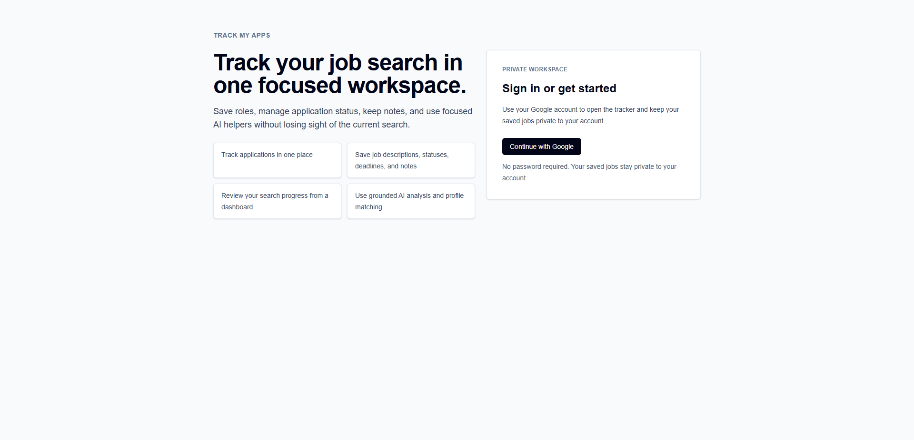

# Track My Apps

Track My Apps is a deployed full-stack job application tracker with AI features grounded in real user data.

Live app: [trackmyapps.dev](https://trackmyapps.dev)

The app is built as a polished tracker first: users save jobs, track status, store notes, maintain a private profile, and use AI only where it is tied to that saved data.

## Why This Project Exists

Job searching spreads context across job posts, notes, status updates, and resume decisions. This project keeps that workflow in one authenticated workspace and shows how to ship AI features without losing user ownership, validation, or production discipline.

## Implemented Features

- Google OAuth sign-in and a protected authenticated workspace
- Job tracking with statuses, notes, archive/delete, and dashboard summaries
- CSV export for saved jobs with user-scoped data access
- CSV import for saved jobs with upload, column mapping, validation preview, duplicate warnings, and explicit confirm import
- Private profile and resume foundation for a single user-owned canonical profile
- AI job description analysis with structured saved output
- AI profile extraction suggestions from saved resume text with review before apply
- Transient profile-to-job matching on job detail pages
- Production-only AI usage limits for job analysis and profile matching
- Server-side ownership checks, validation, and normalized persistence boundaries
- Focused Vitest coverage for core schemas and helper logic
- Deployed custom domain and production-ready app shell

## Planned Features

Future scope includes resume upload/parsing, saved match history, skill-gap detection, tailored resume bullets, cover letters, interview prep, richer filtering, and analytics.

## Tech Stack

- Next.js App Router
- React
- TypeScript
- Tailwind CSS
- Prisma
- PostgreSQL
- NextAuth with Google OAuth
- OpenAI
- Zod

## Architecture Overview

The app uses Next.js Server Components for protected reads and Server Actions for mutations. Feature folders own their own actions, queries, schemas, and components, which keeps the data flow explicit and the codebase easier to explain in an interview. See [docs/architecture.md](docs/architecture.md) for the full notes.

## Database Overview

The schema centers on authenticated, user-owned data: `UserProfile`, `Job`, `Note`, `JobAnalysis`, and AI usage tracking. Job analysis and profile matching stay transient in the UI, while usage tracking records only what is needed for rate limiting. See [docs/schema.md](docs/schema.md) for the full schema reference.

## Local Setup

Install dependencies:

```bash
npm install
```

Create a local environment file:

```bash
cp .env.example .env
```

Configure the values in `.env`:

```bash
DATABASE_URL=
DIRECT_URL=
NEXTAUTH_SECRET=
NEXTAUTH_URL=
GOOGLE_CLIENT_ID=
GOOGLE_CLIENT_SECRET=
OPENAI_API_KEY=
OPENAI_MODEL=
```

For Neon, use the pooled connection string for `DATABASE_URL` and the direct, non-pooled connection string for `DIRECT_URL`. Prisma CLI commands use `DIRECT_URL` through `prisma.config.ts`.

Generate a strong `NEXTAUTH_SECRET`, then create a Google OAuth client and add this local callback URL:

```text
http://localhost:3000/api/auth/callback/google
```

Apply database migrations:

```bash
npm run prisma:migrate
```

Generate Prisma Client:

```bash
npm run prisma:generate
```

If you change `prisma/schema.prisma` and see stale Prisma field errors during local development, regenerate Prisma Client and restart the dev server. If the issue persists, remove `.next` and start `npm run dev` again.

Start the development server:

```bash
npm run dev
```

The app runs at `http://localhost:3000` by default. Visit `http://localhost:3000/sign-in` to sign in with Google.

## Development Commands

```bash
npm run dev
npm run build
npm run lint
npm run test
npm run test:watch
npm run prisma:generate
npm run prisma:migrate
```

## Deployment Notes

This app is suitable for deployment on Vercel with a hosted PostgreSQL database such as Neon.

Deployment checklist:

- Use Node.js `22.x` locally and in Vercel.
- Set all environment variables from `.env.example` in the deployment platform.
- Use a pooled Neon URL for `DATABASE_URL`.
- Use a direct Neon URL for `DIRECT_URL`.
- Set `NEXTAUTH_URL` to the production domain.
- Set `NEXTAUTH_SECRET` to a strong stable value.
- Set `OPENAI_API_KEY` and `OPENAI_MODEL` for server-side AI requests.
- Run Prisma migrations against the production database before using the app.
- Add the production Google OAuth callback URL in Google Cloud Console:

```text
https://your-domain.com/api/auth/callback/google
```

- Do not commit real `.env` values.

For job analysis and profile matching, AI requests are manual and production-limited per authenticated user.

## Screenshots

### Sign In



Clean entry point for Google OAuth access to the tracker.

### Dashboard


High-level view of active jobs, status counts, recent jobs, and upcoming dates.

### Jobs List


Scannable list of saved jobs with status, company, and key metadata.

### Job Detail


Saved posting view with status controls, notes, management actions, and AI panels.

## Project Status

Status: deployed MVP complete, with AI features and production safeguards in place.

Completed:

- Product scope, architecture notes, schema notes, roadmap, and decision records
- Next.js App Router foundation
- TypeScript, Tailwind, and ESLint setup
- Prisma schema, Prisma config, and PostgreSQL migrations
- Google OAuth authentication with Prisma-backed sessions
- Protected dashboard and jobs workspace
- Job tracking workflow with status changes, notes, archive/delete, and summaries
- CSV export for authenticated users across current job-list views
- CSV import for authenticated users with preview, column mapping, validation, and duplicate warnings
- Private profile foundation with AI-assisted extraction suggestions
- Manual AI job analysis saved to `JobAnalysis`
- Transient AI profile-to-job matching on job detail pages
- Production AI usage protections and usage tracking
- Vitest coverage for core validation and helper logic
- Deployed custom domain and production release

Not yet implemented:

- Resume upload and parsing
- Saved match history and deeper scoring
- URL-based job importing
- XLSX import and richer spreadsheet migration support
- Advanced filtering/search
- Dashboard charts and analytics
- Browser-level and integration test coverage

## Roadmap

The implementation roadmap is documented in [docs/roadmap.md](docs/roadmap.md).

Current focus:

- Keep the deployed tracker workflow stable.
- Improve AI quality, reliability, and observability.
- Expand profile and resume foundations before adding more AI generation.
- Add importing, search, filtering, and analytics only when they serve the workflow.
- Expand testing around the highest-value pure logic first.

## What This Project Demonstrates

- Product-first scoping
- Modern Next.js App Router architecture
- Clear server/client boundaries
- Type-safe full-stack development
- Prisma data modeling
- User ownership and authorization checks
- Schema-based validation with Zod
- Feature-oriented folder structure
- Practical AI integration with structured output validation
- Production AI usage limits and transient reports
- Focused automated testing
- Deployed production readiness with a custom domain

The main technical choice is to keep AI grounded in saved user data instead of turning it into speculative generation. That keeps the app useful now and leaves room for future features without sacrificing maintainability.
