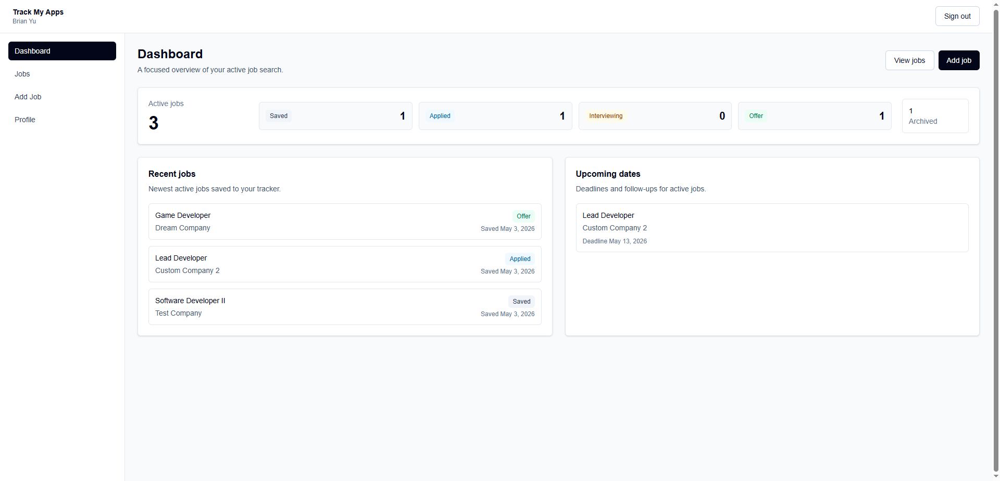
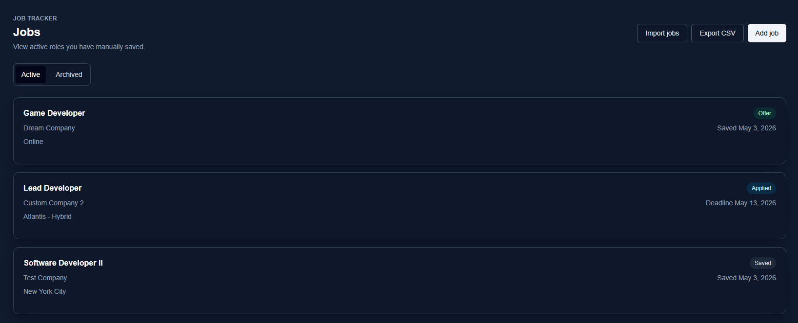
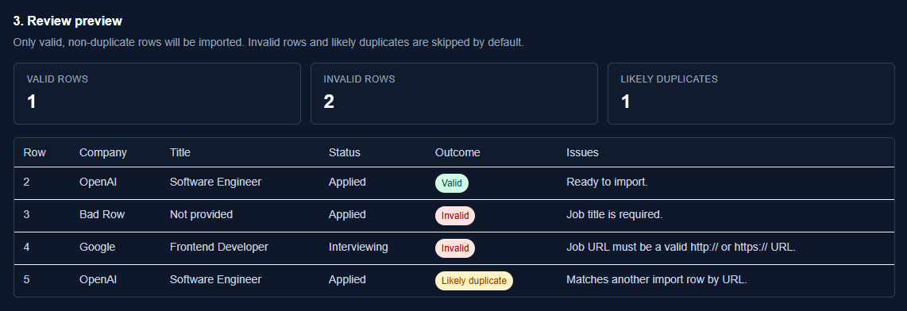
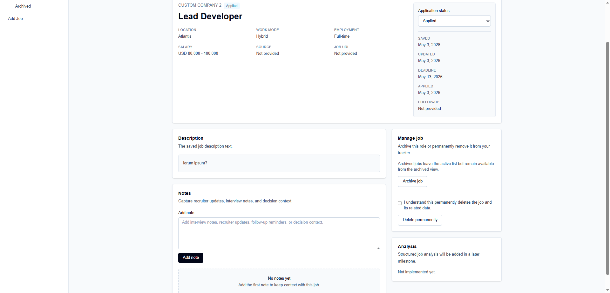
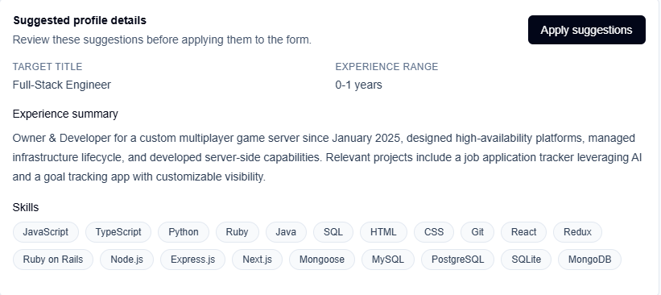

# Track My Apps

Track My Apps is a private job-search workspace for organizing applications, staying on top of next steps, and using AI guidance grounded in saved career data.

## Live Application

**[Open Track My Apps](https://trackmyapps.dev)**

## Features

- **Private workspace:** Google sign-in and account-scoped application data.
- **Application tracking:** Save roles, update statuses, add notes and dates, then archive or remove applications.
- **Networking workspace:** Use deterministic public-search suggestions for each saved role, manually save relevant contacts, and track outreach status and contact-specific follow-ups.
- **Search focus:** A dashboard surfaces follow-ups, upcoming deadlines, missing analysis, interview preparation, and pipeline progress.
- **Flexible job views:** Browse active or archived applications in card or table layouts, with search, filters, sorting, and inline status/archive/delete actions.
- **Portable data:** Review imported CSV rows or batches of supported Greenhouse, Lever, Gem, Rippling ATS, Dover, 4 Day Week, Y Combinator Work at a Startup, and public `JobPosting` JSON-LD URLs before explicitly saving, and export applications as CSV or formatted XLSX.
- **Career profile and resume intake:** Maintain a canonical profile and import text, DOCX, or PDF resumes for review-first profile suggestions.
- **Contextual AI tools:** Analyze saved job descriptions, compare them with a profile, and generate interview-preparation guidance with production usage limits.

## Product Showcase

| Jobs workspace | Import review |
| --- | --- |
|  |  |

| Job details | Profile suggestions |
| --- | --- |
|  |  |

## Tech Stack

- Next.js App Router, React, TypeScript, Tailwind CSS
- Prisma and PostgreSQL
- NextAuth with Google OAuth
- OpenAI, Zod, Vitest
- Upstash Redis for production rate limiting

## Engineering

The app keeps data access on the server, scopes reads and writes to the authenticated user, and validates inputs at feature boundaries. AI output is structured and review-first; durable application data remains separate from transient guidance. Core schemas and helper logic have focused Vitest coverage.

## Further Reading

Technical documentation is available in [docs/](docs/), including the architecture, schema, roadmap, and build log.
